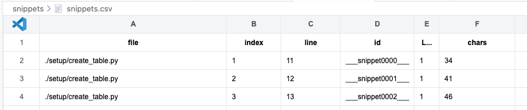

# Extract Snippets from Python Code

This script will scan the given folder looking for patterns like:

```
spark.sql(' some sql ')
```

or 

```
session.sql(' some sql ')
```

It will then create a copy of the code changing those literals by:

```
spark.sql('__ snippet0001 ___')
```

For each snippet a .sql file will be created. The idea is that this can help to externalize the sql strings so they can be easily analyzed.


# How to use it

```

usage: extract_sql.py [-h] --input-folder INPUT_FOLDER --output-preprocessed OUTPUT_PREPROCESSED --output-scripts OUTPUT_SCRIPTS
```

--input-folder points to where the code is

--output-preprocessed is where a copy of your code chaning literals by snippet tags is created

--output-scripts is where the snippets will be created as well as summary report


# Summary report


